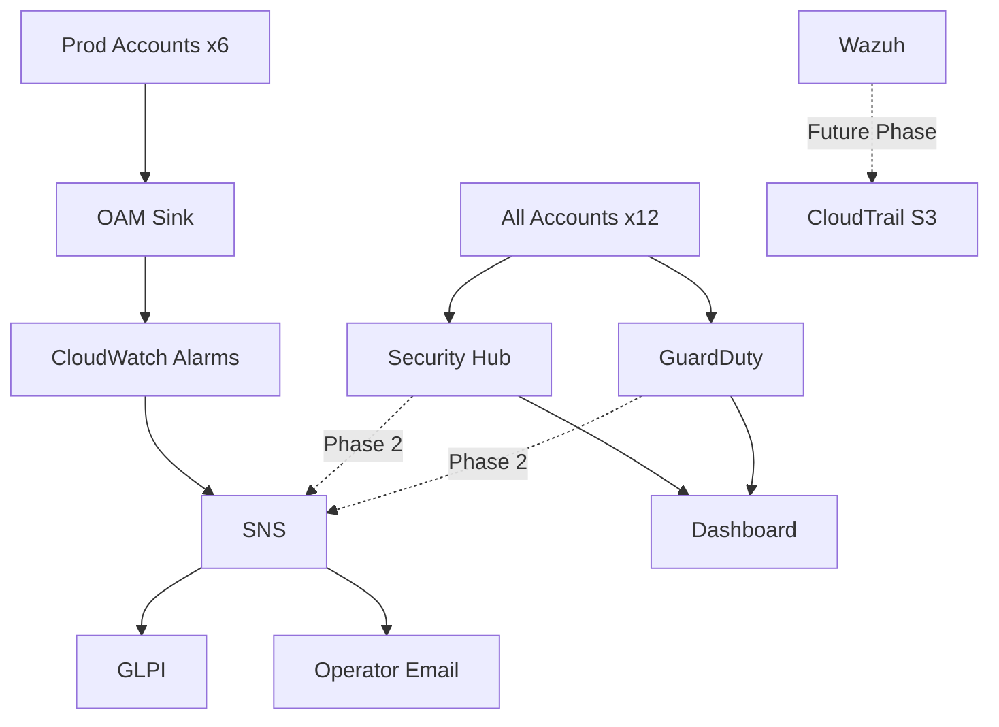
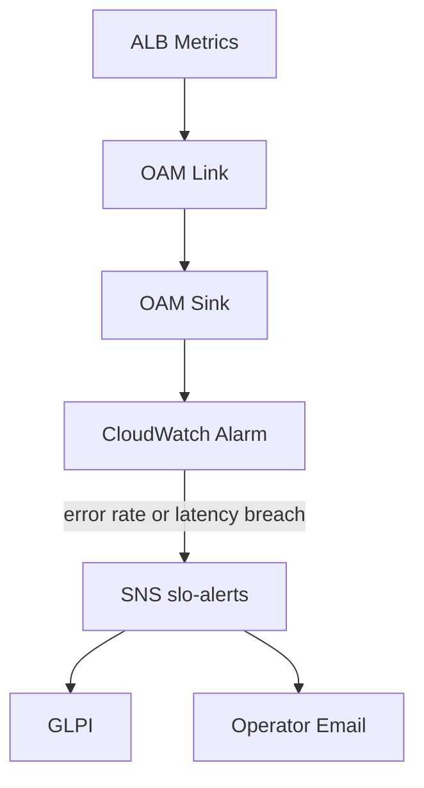
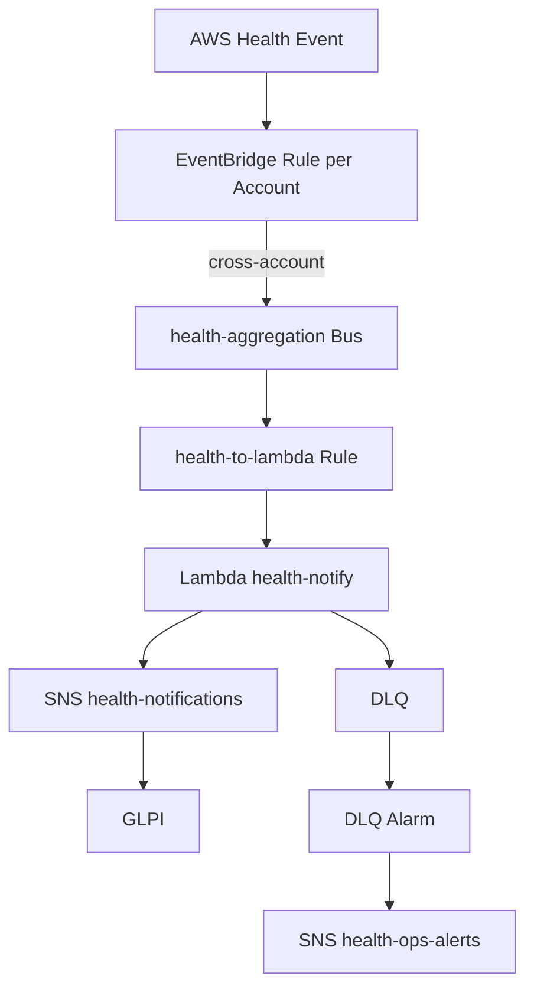
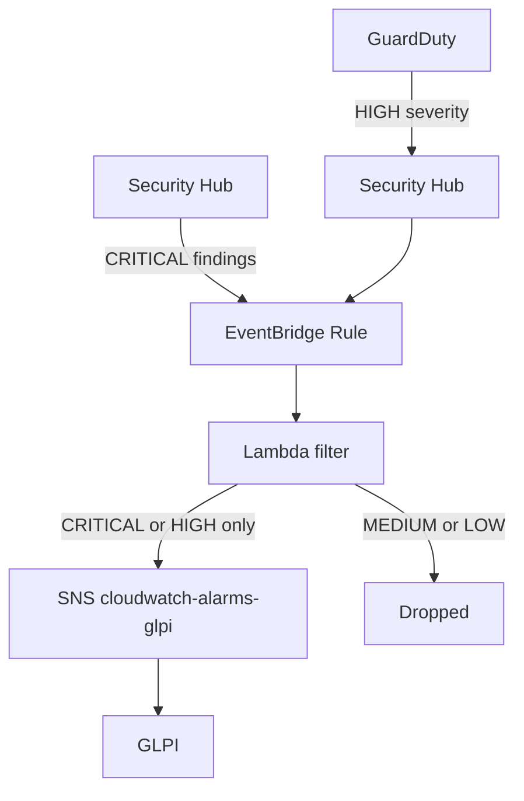
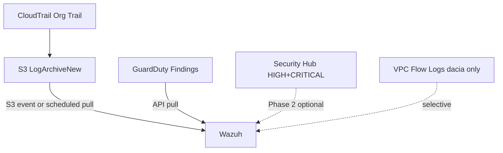
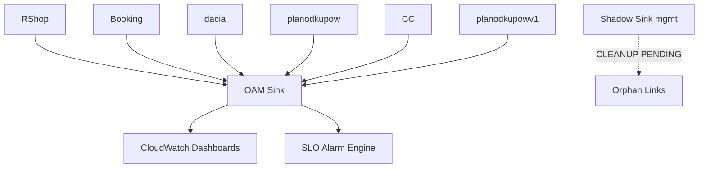

> **Confluence export** — kopia do wklejenia. Zrodlo prawdy: `aws-cloud-platform/docs/architecture/observability-monitoring-architecture.md`
> Aktualizuj oba pliki razem lub wklej tutaj nowa wersje po kazdy rebuild.

---

# Observability & Monitoring Architecture — LLZ AWS Organization

> **Status:** LIVE dokumentacja architektury. Zrodlo prawdy — aktualny Terraform w `platform/monitoring/` i `platform/health-notifications/`.
> **Ostatnia aktualizacja:** 2026-05-09 | Audyt bazowy: `observability-audit-2026-05-09.md`

---

## Dlaczego diagramy sa rozbite

Kazdy diagram ma jeden obowiazek. Powod:

- **Confluence readability** — Mermaid renderuje sie w przegladarce; diagram szerszy niz ekran jest bezuzyteczny dla czytelnika
- **Operational clarity** — tech lead patrzacy na alert flow nie potrzebuje jednoczesnie widziec OAM link ARNow i Wazuh roadmap
- **Maintainability** — jeden diagram per odpowiedzialnosc = jeden punkt do aktualizacji gdy cos sie zmienia
- **Architecture spaghetti prevention** — lagodzone subgraphy Mermaid z 30+ nodami czesto renderuja sie jako chaotyczna siec krawedzi bez hierarchii

Szczegoly techniczne (ARNy, konfiguracja) sa pod diagramem jako tekst — nie jako etykiety na nodach.

---

## Design Principles

- **Central monitoring account** — metryki, alarmy, security findings i health events splywaja do jednego konta (`monitoring-nagios-bot`). Alarmy definiowane raz, routing przewidywalny, brak duplikacji konfiguracji per konto.
- **Low-noise alerting** — 8 alarmow SLO, 0 false positives. Brak alertow ECS/RDS/MQ tworzy blind spoty, ale brak szumu oznacza ze kazdy alarm jest realny.
- **Actionable alerts only** — do GLPI trafia tylko to, co wymaga konkretnej akcji operatora w ciagu godziny. Compliance drift, Low severity findings i informacyjne notyfikacje nie tworza ticketow.
- **Minimal cost observability** — OAM cross-account zamiast agentow per konto, CloudTrail → S3 zamiast → CloudWatch Logs, retention 14d zamiast 90d tam gdzie to mozliwe.
- **AWS-native approach** — brak zewnetrznych SaaS. OAM, EventBridge, Lambda, SNS, Security Hub delegated admin. Stack kontrolowany przez Terraform.

---

## Non-Goals

Jawnie czego ta architektura NIE robi i NIE bedzie robic:

- **Nie budujemy enterprise SIEM** — brak centralnego log aggregation dla wszystkich workloadow
- **Nie wdrazamy full packet inspection** — VPC Flow Logs sa opcjonalne i wlaczane selektywnie tylko tam gdzie jest konkretna potrzeba (aktualnie: dacia)
- **Nie logujemy wszystkiego do CloudWatch** — WAF logs, ALB access logs i ECS container logs nie trafiaja do CloudWatch jako standard; koszt vs signal jest nieuzasadniony
- **Nie ticketujemy compliance drift** — Security Hub MEDIUM/LOW i Config NON_COMPLIANT z powodu swiadomie wylaczonych features GuardDuty nie ida do GLPI
- **Nie rozmawiamy o Datadog ani Splunk** — koszt 10-20x wyzszy niz aktualny stack przy tej samej lub nizszej wartosci operacyjnej dla organizacji tej wielkosci
- **Nie robimy full log ingestion do Wazuh** — Wazuh otrzyma CloudTrail (S3) i GuardDuty findings; nie wszystkie logi aplikacyjne

---

## 1. Executive Summary

`monitoring-nagios-bot` (814662658531) jest centralnym hubem obserwability dla organizacji LLZ (`o-5c4d5k6io1`). Pelni role delegated administrator dla Security Hub, GuardDuty i AWS Config oraz jest destynacja OAM sink dla metryk, logow i traces ze wszystkich kont zrodlowych.

Dwa kanaly do GLPI sa aktywne: SLO alerts (CloudWatch → SNS) i AWS Health events (EventBridge → Lambda → SNS). Security findings (GuardDuty, Security Hub) sa planowane w Phase 2. Wazuh jest w fazie planowania.

| Zrodlo | Typ | Status |
|--------|-----|--------|
| CloudWatch SLO alarms (ALB) | SLO breach | LIVE → GLPI |
| AWS Health EventBridge | Incydenty i maintenance AWS | LIVE → GLPI |
| Security Hub | Security findings | Dashboard only |
| GuardDuty | Threat detection | Dashboard only |
| AWS Config | Compliance drift | Dashboard only |
| AWS Budgets / Cost Anomaly | FinOps | Email osobisty |

---

## 2. Diagram 1 — Executive Overview

Central monitoring account jako hub dla calej organizacji.

**Legenda:**
- Linia ciagla — flow aktywny (LIVE)
- Linia przerywana — planowany (Phase 2 lub Future Phase)
- `Prod Accounts x6` — RShop, Booking, dacia, planodkupow, CC, planodkupowv1
- `All Accounts x12` — wszystkie aktywne konta lacznie z management, DRP-TFS, lab

---

## 3. Diagram 2 — SLO Alert Flow

Jak breach progu SLO na frontendie (ALB) trafia do ticketu GLPI.

**Szczegoly:**
- 8 alarmow: error rate > 1% (3/5 min) i latency p99 dla RShop, Booking, dacia, planodkupow/bbmt-uat
- `treat_missing_data = notBreaching` — brak danych nie odpala alarmu (cross-account safe)
- `datapoints_to_alarm` — minimum 2-3 naruszen przed alarmem, eliminuje spikes
- SNS `slo-alerts` ma dwoch subskrybentow: `glpi@infra.makolab.pl` i `jaroslaw.golab@makolab.com`
- Alarmy definiowane w koncie `monitoring-nagios-bot`, metryki pobierane cross-account przez OAM metric math

---

## 4. Diagram 3 — AWS Health Flow

Jak eventy AWS Health (awarie, maintenance, notyfikacje) trafiaja do GLPI ze wszystkich 12 kont.

**Szczegoly:**
- EventBridge rule `health-to-monitoring` istnieje w kazdym z 12 aktywnych kont (us-east-1 — wymaganie AWS Health API)
- Lapane kategorie: `issue`, `investigation`, `scheduledChange`, `accountNotification` (od 2026-05-09)
- `health-aggregation` bus w koncie monitoring-nagios-bot, region us-east-1
- Lambda `health-notify` enrichuje event i wysyla do SNS `health-notifications` (eu-central-1)
- DLQ monitoring: jesli Lambda failuje, alarm na DLQ depth → `health-ops-alerts` → operator email
- Subskrybent `health-notifications`: `glpi@infra.makolab.pl` (potwierdzony)

---

## 5. Diagram 4 — Security Flow (Phase 2)

Planowany routing security findings do GLPI. Aktualnie findings sa widoczne tylko w dashboardach.

**Szczegoly:**
- Status: **PLANNED Phase 2** — infrastruktura SNS i subskrybent glpi@ istnieja, brakuje Lambda i EventBridge rule
- Filtr w Lambda: tylko `WorkflowStatus = NEW`, severity >= HIGH
- GuardDuty finding frequency: aktualnie `SIX_HOURS` — do zmiany na `FIFTEEN_MINUTES` w Phase 2
- Suppressowane: Security Hub LOW/MEDIUM compliance findings (FSBP, CIS dla swiadomie wylaczonych GD features)
- SNS `cloudwatch-alarms-glpi` (eu-central-1, monitoring-nagios-bot) — istnieje, subskrybent glpi@ potwierdzony, czeka na producentow

---

## 6. Diagram 5 — Wazuh Future Phase

Planowana integracja z Wazuh. Tylko bezpieczne zrodla o niskim volume.

**Szczegoly:**
- CloudTrail → S3 juz istnieje i jest oplacony; Wazuh czyta z S3, nie z CloudWatch (unikamy double ingest)
- GuardDuty findings: niski volume (32 LOW findings/mies), jasna wartosc security
- VPC Flow Logs: tylko dacia (juz aktywne), selektywnie — nie standard dla wszystkich kont
- **Nie integrujemy:** WAF logs, ALB access logs, ECS container logs, AmazonMQ logs
- Wazuh deployment poza scope tego dokumentu

---

## 7. Diagram 6 — OAM Cross-Account Observability

Jak metryki i logi ze zrodel trafiaja do centralnego CloudWatch.

**Szczegoly:**
- OAM Sink: `arn:aws:oam:eu-central-1:814662658531:sink/dc0f8121-e9d4-4103-afb0-7d8031e72570`
- Resource types per link: `AWS::CloudWatch::Metric`, `AWS::Logs::LogGroup`, `AWS::XRay::Trace`
- Sink policy: tylko konta z tej samej organizacji (`aws:PrincipalOrgID = o-5c4d5k6io1`)
- **Gap:** DRP-TFS, Admin MakoLab, LogArchiveNew, lab — brak OAM link
- **Znany problem:** management account ma shadow sink (nieutworzony przez Terraform) — RShop i planodkupow wysylaja metryki do dwoch sinkow jednoczesnie; do usuniecia

---

## 8. Alert Routing Matrix

| Zrodlo | Sygnal | Severity | Destynacja | Ticket GLPI | SLA | Status |
|--------|--------|----------|------------|-------------|-----|--------|
| CloudWatch / OAM | SLO error rate > 1% | CRITICAL | slo-alerts | Tak | 15 min | LIVE |
| CloudWatch / OAM | SLO latency p99 | CRITICAL | slo-alerts | Tak | 15 min | LIVE |
| AWS Health | issue / investigation | HIGH | health-notifications | Tak | 30 min | LIVE |
| AWS Health | scheduledChange | MEDIUM | health-notifications | Tak | 24h | LIVE |
| AWS Health | accountNotification | INFO | health-notifications | Tak | 48h | LIVE |
| GuardDuty | HIGH (>= 7.0) | CRITICAL | cloudwatch-alarms-glpi | Planowany | 1h | PLANNED Phase 2 |
| Security Hub | CRITICAL (NEW) | CRITICAL | cloudwatch-alarms-glpi | Planowany | 1h | PLANNED Phase 2 |
| Security Hub | HIGH (wybrane) | HIGH | cloudwatch-alarms-glpi | Selektywny | 4h | PLANNED Phase 2 |
| ECS | stopped tasks | HIGH | brak alarmow | Planowany | 30 min | PLANNED Phase 2 |
| ECS | CPU/Memory sustained | MEDIUM | brak alarmow | Nie | — | PLANNED Phase 2 |
| RDS | connections / CPU / storage | HIGH | brak alarmow | Nie | — | PLANNED Phase 2 |
| AmazonMQ | queue depth | HIGH | brak alarmow | Nie | — | PLANNED Phase 2 |
| ElastiCache | evictions | MEDIUM | brak alarmow | Nie | — | PLANNED Phase 2 |
| AWS Budgets | cost anomalia | INFO | cost-anomaly-alerts | Nie | 24h | LIVE (email) |
| Security Hub | MEDIUM / LOW | LOW | dashboard | Nie | — | DASHBOARD ONLY |
| GuardDuty | MEDIUM (4-6.9) | MEDIUM | dashboard | Nie | — | DASHBOARD ONLY |
| GuardDuty | LOW (< 4) | LOW | — | Nie | — | IGNORED |
| Config | NON_COMPLIANT (GD features) | INFO | — | Nie | — | IGNORED |

---

## 9. Monitoring Coverage Matrix

| Konto | OAM | SLO | Security Hub | GuardDuty | Config | Health Events | Uwagi |
|-------|-----|-----|--------------|-----------|--------|---------------|-------|
| RShop | tak | 2 alarmy | tak | tak | tak | tak | duplikat OAM link do shadow sink |
| Booking Online | tak | 2 alarmy | tak | tak | tak | tak | OK |
| dacia-asystent | tak | 2 alarmy | tak | tak | tak | tak | VPC Flow Logs aktywne |
| planodkupow | tak | 2 alarmy bbmt-uat | tak | tak | tak | tak | duplikat OAM; MQ logi 14d |
| CC | tak | brak ALB prod | tak | tak | tak | tak | ECS cluster bez prod ALB |
| planodkupowv1 | tak | wylaczone (NONPROD) | tak | tak | tak | tak | swiadoma decyzja |
| DRP-TFS | **brak** | brak | tak | tak | tak | tak | GAP — aktywne konto, root credential alerts |
| Admin MakoLab | **brak** | brak | tak | tak | tak | tak | niska priorytet |
| LogArchiveNew | **brak** | brak | tak | tak | tak | tak | S3-only archiwum, akceptowalny gap |
| lab | **brak** | brak | tak | tak | tak | tak | sandbox, swiadomy gap |
| makolab_dc (mgmt) | hub | brak | tak | tak | tak | tak | shadow sink do usuniecia |
| monitoring-nagios-bot | hub (sink) | — | hub | hub | hub | tak | 70 findings glownie FSBP szum |

**OAM coverage:** prod 5/5 = 100% | wszystkie aktywne konta 6/10 = 60%

---

## 10. Alert Classification Model

### Tier 1 — auto-ticket GLPI

Breach wymaga akcji operatora w ciagu godziny. Jasny owner. Actionable.

| Sygnal | Routing | Uzasadnienie |
|--------|---------|--------------|
| SLO error rate > 1% na prod ALB | slo-alerts → glpi@ | Uzytkownik koncowy czuje degradacje, SLA naruszone |
| SLO latency p99 > prog | slo-alerts → glpi@ | j.w. |
| AWS Health issue / investigation | health-notifications → glpi@ | Awaria infrastruktury AWS wymaga reakcji |
| AWS Health scheduledChange | health-notifications → glpi@ | Operator musi zaplanowac maintenance window |
| GuardDuty HIGH (>= 7.0) | PLANOWANY → glpi@ | Potencjalny kompromis, triage w 1h |
| Security Hub CRITICAL (NEW) | PLANOWANY → glpi@ | Krytyczne naruszenie, wymaga analizy |
| ECS stopped tasks | PLANOWANY → glpi@ | Silent failure — bez alertu operator nie wie |

### Tier 2 — dashboard / przeglad tygodniowy

Wazne, ale nie wymaga natychmiastowej reakcji.

| Sygnal | Routing | Uzasadnienie |
|--------|---------|--------------|
| ECS CPU/Memory sustained | CloudWatch Dashboard | Planowanie skalowania, nie incydent |
| RDS connection count rosnacy | CloudWatch Dashboard | Trend, nie awaria |
| GuardDuty MEDIUM (4-6.9) | Security Hub dashboard | Wymaga analizy, nie akcji |
| Security Hub HIGH (compliance FSBP) | Security Hub dashboard | Governance review, nie operacyjny incydent |
| Config NON_COMPLIANT | Config dashboard | Weekly review |
| Cost anomalia | Email operator | Decyzja FinOps, nie incident |

### Tier 3 — ignorowane / suppressowane

Znane wylaczenia swiadome lub szum bez wartosci operacyjnej.

| Sygnal | Uzasadnienie |
|--------|--------------|
| GuardDuty LOW (port scan, recon) | 32 findings, praktycznie all internet background noise |
| Security Hub MEDIUM/LOW (FSBP, CIS) | 73/92 findings to artifact wyłaczonych GD features — known exception |
| Config NON_COMPLIANT dla GD features | Swiadoma decyzja kosztowa, nie drift |
| AmazonMQ heartbeat / connection logi | Operacyjne logi bez wartosci security |
| ECS task health check szum | Przejsciowe stany przy deployu |

---

## 11. Signal vs Noise Philosophy

Kazdy dodatkowy log, metric i finding ma koszt trojwymiarowy: pieniadze (ingest, storage, egress), czas (triage, review, ticket handling) i uwaga (alert fatigue niszczy zdolnosc reagowania na realne incydenty).

**Dlaczego SLO zamiast pojedynczych metryk:** Metryka "CPU 70%" nie mowi nic o tym czy uzytkownik odczuwa problem. ALB error rate > 1% mowi wprost: klient czuje degradacje. SLO-first eliminuje false positives i zwieksza wiarygodnosc — kazdy alarm jest realny.

**Dlaczego nie VPC Flow Logs wszedzie:** Jedno konto ECS + AmazonMQ generuje setki MB dziennie. Przy 5 kontach prod i 30-dniowej retencji: 50-100 USD extra za dane, z ktorych 99% to szum TCP/UDP. Aktywne tylko dla dacia gdzie jest konkretna potrzeba.

**Dlaczego compliance findings nie ida do GLPI:** 73 z 92 Security Hub findings to FSBP/CIS checks dla swiadomie wylaczonych features GuardDuty. Auto-ticketowanie stworzyloby 70+ ticketow tygodniowo, z ktorych zadnego operator nie powinien zamknac inaczej niz "known exception".

---

## 12. Cost-Safe Observability Principles

Baseline kosztowy (po Phase 1):

| Usluga | Koszt/mies | Uwagi |
|--------|-----------|-------|
| CloudTrail (org-wide) | ~99 USD | Konieczny; Wazuh czyta z S3, nie z CW |
| GuardDuty (podstawowe) | ~24 USD | Konieczny |
| Security Hub | ~3-5 USD | Konieczny dla delegated admin |
| CloudWatch Alarms (8 SLO) | ~1.5 USD | Niski koszt, wysokie pokrycie |
| CloudWatch Metrics (OAM) | ~41 USD | Cross-account metryki — core capability |
| CloudWatch Dashboards | ~6 USD | Wizualizacja |
| CloudWatch DataProcessing | ~53 USD | Glownie MQ logi — optymalizacja w toku |
| CloudWatch Canary | ~36 USD | Do weryfikacji — aktywny? jaka czestotliwosc? |
| **Total** | **~265-270 USD** | |

**Zasady:**
- OAM cross-account zamiast agentow — brak instalacji, brak zarzadzania, brak zewnetrznego SaaS
- Retention 14d dla logow operacyjnych, 90d+ tylko dla compliance/security
- CloudTrail → S3, nie → CloudWatch Logs (double ingest = double cost)
- Jeden OAM link per konto (brak duplikatow do shadow sink)
- Nie wlaczac VPC Flow Logs, WAF, ALB access logs jako standard

---

## 13. Current Known Gaps

| Gap | Konta | Priorytet | Uwagi |
|-----|-------|-----------|-------|
| ECS stopped tasks / service unhealthy | RShop, Booking, dacia, planodkupow | HIGH | Silent failure — crashujacy kontener nie tworzy incydentu |
| RDS connection saturation / CPU / storage | planodkupow, dacia, rshop | HIGH | RDS = 300 USD/mies, 0 alarmow |
| AmazonMQ queue depth | planodkupow | HIGH | 103 USD/mies broker, 0 alarmow |
| ElastiCache evictions | planodkupow | MEDIUM | Cache eviction = latency spike |
| Security findings → GLPI routing | wszystkie | HIGH | Lambda + EventBridge rule brakuje |
| GuardDuty SIX_HOURS finding frequency | wszystkie | MEDIUM | Do zmiany na FIFTEEN_MINUTES dla HIGH |
| OAM link dla DRP-TFS | DRP-TFS | MEDIUM | Aktywne konto, root credential alerts bez widocznosci |
| Shadow OAM sink (management account) | makolab_dc | LOW | Duplikat metryk RShop i planodkupow |
| org-cloudwatch-alarms-to-sns EventBridge rule | management | LOW | Martwy — do usuniecia recznie |
| org-central-alarms SNS topic | management | LOW | 0 subskrybentow — do usuniecia recznie |
| Canary weryfikacja | Booking Online? | LOW | 36 USD/mies bez potwierdzenia aktywnosci |

---

## 14. Recommended Roadmap

### Quick Wins — zrobione (2026-05-09)

| Zmiana | Efekt |
|--------|-------|
| glpi@ → SNS slo-alerts | SLO breaches → GLPI, nie tylko email osobisty |
| AmazonMQ log retention: 90d → 14d | ~30-40 USD/mies oszczednosc |
| Health event pattern + scheduledChange + accountNotification | Pelne pokrycie Health events |
| Usunieto dc@makolab.com PENDING subscription | Czyste SNS |

### Phase 2 — rekomendowane

- Lambda + EventBridge rule: Security Hub CRITICAL / GuardDuty HIGH → SNS `cloudwatch-alarms-glpi` → GLPI
- GuardDuty finding frequency: SIX_HOURS → FIFTEEN_MINUTES dla HIGH findings
- Suppress Security Hub findings dla swiadomie wylaczonych GD features (jednorazowe)
- ECS service alarms: stopped tasks (zero tolerance), CPU/Memory sustained
- RDS alarms: FreeStorageSpace, DatabaseConnections, CPUUtilization
- AmazonMQ queue depth alarm dla planodkupow
- OAM link dla DRP-TFS
- Shadow sink cleanup (management account)
- Dodac glpi@ do health-ops-alerts SNS (redundancja DLQ alertow)
- Reczne usuniecie martwych zasobow w management account

### Future Phase — po Phase 2

- Wazuh integration: CloudTrail (S3) + GuardDuty findings
- Canary frequency optimization (jesli aktywny)
- Ewentualna ocena GuardDuty S3 Data Events (koszt vs wartosc)
